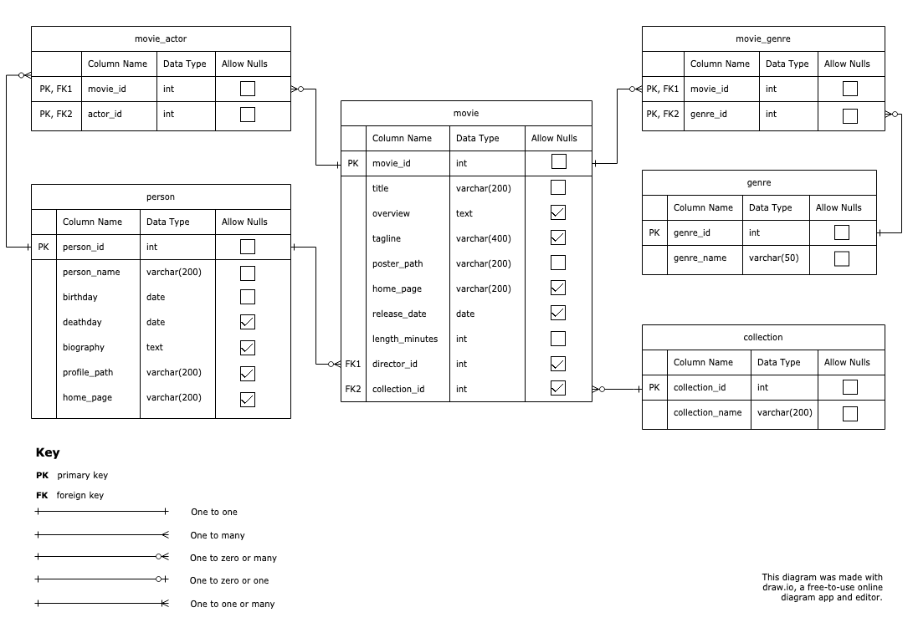

# Mike's Notes - SQL

## MovieDB ERD



<div style="break-after: page"></div>

## SELECT a whole table

```sql
select * 
from movie;
```
(outputs whole table)

## LIMIT rows returned

```sql
select *
from movie limit 5
```

| movie_id | title                                             | overview | tagline | poster_path                                                     | home_page                                                                 | release_date | length_minutes | director_id | collection_id |
| -------- | ------------------------------------------------- | -------- | ------- | --------------------------------------------------------------- | ------------------------------------------------------------------------- | ------------ | -------------- | ----------- | ------------- |
| 1891     | The Empire Strikes Back                           | null     | null    | https://image.tmdb.org/t/p/w500/7BuH8itoSrLExs2YZSsM01Qk2no.jpg | http://www.starwars.com/films/star-wars-episode-v-the-empire-strikes-back | 1980-05-20   | 124            | 10930       | 10            |
| 120      | The Lord of the Rings: The Fellowship of the Ring | null     | null    | https://image.tmdb.org/t/p/w500/6oom5QYQ2yQTMJIbnvbkBL9cHo6.jpg | http://www.lordoftherings.net/                                            | 2001-12-18   | 179            | 108         | 119           |
| 27205    | Inception                                         | null     | null    | https://image.tmdb.org/t/p/w500/9gk7adHYeDvHkCSEqAvQNLV5Uge.jpg | http://inceptionmovie.warnerbros.com/                                     | 2010-07-15   | 148            | 525         | null          |
| 121      | The Lord of the Rings: The Two Towers             | null     | null    | https://image.tmdb.org/t/p/w500/5VTN0pR8gcqV3EPUHHfMGnJYN9L.jpg | http://www.lordoftherings.net/                                            | 2002-12-18   | 179            | 108         | 119           |
| 101      | Léon: The Professional                            | null     | null    | https://image.tmdb.org/t/p/w500/jtNOfwZu3zea5grnqpq4nyqXoID.jpg | null                                                                      | 1994-09-14   | 111            | 59          | null          |
|          |                                                   |          |         |                                                                 |                                                                           |              |                |             |               |

<div style="break-after: page"></div>

## SELECT Only Certain Columns

We can list which columns to show by putting a comma-separate list of columns instead of the asterisk (*)

```sql
select movie_id, title, length_minutes 
from movie 
limit 5;
```

| title                                             | length_minutes |
| ------------------------------------------------- | -------------- |
| The Empire Strikes Back                           | 124            |
| The Lord of the Rings: The Fellowship of the Ring | 179            |
| Inception                                         | 148            |
| The Lord of the Rings: The Two Towers             | 179            |
| Léon: The Professional                            | 111            |

## SELECT DISTICT values for a field

We can get unique values for a certain column using `DISTINCT`

```sql
select distinct director_id
from movie limit 5;
```

| director_id |
| -- |
| null |
| 1364881 |
| 140617 |
| 57741 |
| 101666 |

<div style="break-after: page"></div>

### WHERE Filter Operators

| Operator       | Example                               | Notes                            |
| -------------- | ------------------------------------- | -------------------------------- |
| =              | ```title = 'Star Wars'```             | Equals                           |
| !=             | ```title != 'Star Wars'```            | Not equals                       |
| >,<,>=,<=      | ```releaseDate > '1980-01-01```       | Greater than, Less than          |
| LIKE, NOT LIKE | ```title like 'Star %'```             | Equals/Not equals with wildcards |
| BETWEEN        | ```length_minutes between 0 and 60``` | Combined <= and >=               |
| IS NULL        | ```director_id is null```             | Null check                       |
| IS NOT NULL    | ```director_id is not null```         | Not null check                   |

<div style="break-after: page"></div>

## Simple WHERE Filter

We can filter the rows returned with a `WHERE` clause.

```sql
select movie_id, title 
from movie 
where title = 'Star Wars'
limit 5;
```

| movie_id | title     |
| -------- | --------- |
| 11       | Star Wars |


## Compound WHERE Filter

We can use `and`, `or`, and `not` as well as parentheses to combine multiple filters.

```sql
select movie_id, title 
from movie 
where title = 'Star Wars' or (title like 'T%' and length_minutes > 120)
limit 5;
```

| movie_id | title                                             |
| -------- | ------------------------------------------------- |
| 1891     | The Empire Strikes Back                           |
| 120      | The Lord of the Rings: The Fellowship of the Ring |
| 121      | The Lord of the Rings: The Two Towers             |
| 11       | Star Wars                                         |
| 603      | The Matrix                                        |

<div style="break-after: page"></div>

## Calculated Columns

You can use `||` to concatenate values into one, as well as arithmetic operators (`+`, `-`, `*`, `/`, `%`) to create a calculated field value:

```sql
select movie_id, title, (length_minutes / 60)
from movie 
limit 5;
```

| movie_id | title                                             | ?column? |
| -------- | ------------------------------------------------- | -------- |
| 1891     | The Empire Strikes Back                           | 2        |
| 120      | The Lord of the Rings: The Fellowship of the Ring | 2        |
| 27205    | Inception                                         | 2        |
| 121      | The Lord of the Rings: The Two Towers             | 2        |
| 101      | Léon: The Professional                            | 1        |

## Column Aliasing with AS

```sql
select 
    movie_id, 
    title, 
    (length_minutes / 60) as hours, 
    (length_minutes % 60) as minutes
from movie 
limit 5;
```

| movie_id | title                                             | hours | minutes |
| -------- | ------------------------------------------------- | ----- | ------- |
| 1891     | The Empire Strikes Back                           | 2     | 4       |
| 120      | The Lord of the Rings: The Fellowship of the Ring | 2     | 59      |
| 27205    | Inception                                         | 2     | 28      |
| 121      | The Lord of the Rings: The Two Towers             | 2     | 59      |
| 101      | Léon: The Professional                            | 1     | 51      |

<div style="break-after: page"></div>

## Simple ORDER BY

```sql
select movie_id, title, director_id
from movie 
order by director_id asc
limit 5;
```

| movie_id | title                                        | director_id |
| -------- | -------------------------------------------- | ----------- |
| 1894     | Star Wars: Episode II - Attack of the Clones | 1           |
| 11       | Star Wars                                    | 1           |
| 1895     | Star Wars: Episode III - Revenge of the Sith | 1           |
| 1893     | Star Wars: Episode I - The Phantom Menace    | 1           |
| 10681    | WALL·E                                       | 7           |

## Multiple ORDER BY

```sql
select movie_id, title, director_id
from movie 
order by director_id asc, title desc
limit 5;
```

| movie_id | title                                        | director_id |
| -------- | -------------------------------------------- | ----------- |
| 1893     | Star Wars: Episode I - The Phantom Menace    | 1           |
| 1895     | Star Wars: Episode III - Revenge of the Sith | 1           |
| 1894     | Star Wars: Episode II - Attack of the Clones | 1           |
| 11       | Star Wars                                    | 1           |
| 10681    | WALL·E                                       | 7           |

<div style="break-after: page"></div>

## GROUP BY (Pt. 1/2)

Grouping "rolls up" rows according to a common field value.  In the `SELECT`, we
can only include field(s) that we grouped on and aggregate functions applied to other
fields.

If we group this table by director_id, each color of row gets rolled up into one row:

```sql
select director_id, title, length_minutes
from movie
where director_id in (1, 7, 8)
order by director_id;
```

| director_id                        | title                                        | length_minutes |
| ---------------------------------- | -------------------------------------------- | -------------- |
| <span style="color:red">1</span>   | Star Wars                                    | 121            |
| <span style="color:red">1</span>   | Star Wars: Episode III - Revenge of the Sith | 140            |
| <span style="color:red">1</span>   | Star Wars: Episode I - The Phantom Menace    | 136            |
| <span style="color:red">1</span>   | Star Wars: Episode II - Attack of the Clones | 142            |
| <span style="color:blue">7</span>  | WALL·E                                       | 98             |
| <span style="color:blue">7</span>  | Finding Nemo                                 | 100            |
| <span style="color:green">8</span> | Toy Story 3                                  | 103            |
| <span style="color:green">8</span> | Coco                                         | 105            |

```sql
select director_id
from movie
where director_id in (1, 7, 8)
group by director_id
order by director_id;
```

| director_id                        |
| ---------------------------------- |
| <span style="color:red">1</span>   |
| <span style="color:blue">7</span>  |
| <span style="color:green">8</span> |

<div style="break-after: page"></div>

## GROUP BY (Pt. 2/2)

If we group on the `director_id`, however, we can not refer to the other fields, as they now refer to
multiple values.  For examle, the column `title` in the blue rows would now refer to both `WALL-E`
and `Finding Nemo`.

In order to refer to other fields, we have to use what is called an aggregate function.  Aggregate
functions explain how to choose or calculate a single value among many.  For example, `MIN()` lets
us choose the smallest, so that we can include `length_minutes` for each director and it will choose
the lowest value for `length_minutes` among those in the rolled up rows for that director:

```sql
select director_id, min(length_minutes) as shortest_movie_length
from movie
where director_id in (1, 7, 8)
group by director_id
order by director_id;
```

| director_id                        | shortest_movie_length |
| ---------------------------------- | --------------------- |
| <span style="color:red">1</span>   | 121                   |
| <span style="color:blue">7</span>  | 98                    |
| <span style="color:green">8</span> | 103                   |

## Aggregating without GROUP BY

We can also aggregate without `group by`, but it will cause or entire result set to roll-up 
into one row:

```sql
select max(length_minutes) as longest_movie_length
from movie
```

| longest_movie_length |
| -------------------- |
| 467                  |

<div style="break-after: page"></div>

## Common Aggregate Functions

| Function   | Description                                                             |
| ---------- | ----------------------------------------------------------------------- |
| min(col)   | Takes the minimum of all collapsed values for a column                  |
| max(col)   | Takes the macimum of all collapsed values for a column                  |
| count(col) | Takes the # of rows collapsed (ignoring rows with a null in the column) |
| sum(col)   | Takes the total of all values in collapsed rows for a column            |
| avg(col)   | Takes the average of all values in collapsed rows for a column          |

<div style="break-after: page"></div>

## Single Column, Single Row Subqueries

Can be used in place of a *value* anywhere in a query (e.g. the `where` clause)

```sql
select title, length_minutes 
from movie 
where length_minutes = (select max(length_minutes) from movie);
```

| title                 | length_minutes |
| --------------------- | -------------- |
| O.J.: Made in America | 467            |

## Single Column, Multiple Row Subqueries

Can be used in place of a *list* anywhere in a query (e.g. the `where` clause)

```sql
select title, length_minutes 
from movie 
where director_id in (select person_id from person where birthday > '1970-01-01') 
limit 3;
```

| title                  | length_minutes |
| ---------------------- | -------------- |
| Inception              | 148            |
| Avengers: Endgame      | 181            |
| Avengers: Infinity War | 149            |

<div style="break-after: page"></div>

## Multiple Column, Multiple Row Subqueries

Can be used in place of a *table* anywhere in a query (e.g. the `join` clause)

```sql
select title, length_minutes, p.person_name 
from movie
join (
    select person_id, person_name  
    from person 
    where birthday > '1970-01-01'
) as p on movie.director_id = p.person_id
limit 2;
```

| title                  | length_minutes | person_name       |
| ---------------------- | -------------- | ----------------- |
| Inception              | 148            | Christopher Nolan |
| Avengers: Endgame      | 181            | Anthony Russo     |

## Table Aliasing

In any query, we can alias a table by putting a name after the table name when it appears in a
`from` or `join` clause.

This is useful for shorter typing, and is necessary when we want to join a table multiple times
to disambiguate between different `JOIN`ed copies of a table.

```sql
select m.title, m.length_minutes
from movie m
where m.length_minutes > 120
limit 3;
```

| title                                             | length_minutes |
| ------------------------------------------------- | -------------- |
| The Empire Strikes Back                           | 124            |
| The Lord of the Rings: The Fellowship of the Ring | 179            |
| Inception                                         | 148            |

## INNER JOINs

Joins values from another table into our results connecting on some field
(Any rows that fail to connect the other table data **ARE NOT** included)

Note that any rows that could match multiple rows in the joined table are 
repeated.

```sql
```

## LEFT JOINs

Joins values from another table into our results connecting on some field
(Any rows that fail to connect the other table data **ARE** included)

```sql
```

## Combining JOIN with GROUP BY to get child/related row aggregates

A common thing that comes up is to join to a related table and simply get the
count or sum of rows that matched on the join.

```sql
```

## Basic INSERT

## INSERT with a subquery

## INSERT with select


## UPDATE

## UPDATE with a subquery

## UPDATE with FROM

## DELETE

## DELETE with a subquery

## DELETE with FROM

## CREATE database script structure

## CREATE TABLE

## ALTER TABLE


